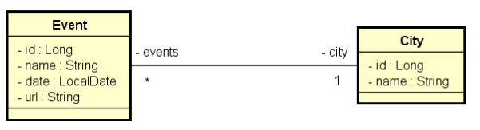

<h2 align="center">
   TDD (Automated Tests) - Spring Boot Bootcamp Project 0.2
</h2>

<figure>

  

</figure>

# About
This project was developed as a TDD challenge, using Spring Boot and the JUnit testing framework. The goal of the challenge was to implement automated tests for two control classes: CityController and EventController, using the TDD (Test Driven Development) software development pattern.

[DevSuperior](https://devsuperior.com.br/) Spring Boot Bootcamp Project 0.2: TDD (Test Driven Development). 

## Technologies used
- STS (Spring Tool Suite)
- PostMan
- PostgreSQL 12
- PgAdmin

## Back end
- Java 17 
- JDK 17 ZULU
- Spring Boot
- JPA / Hibernate
- Maven
- JUnit5

## Images
<figure>

  
    
  <figcaption>Conceptual Model</figcaption>

</figure>
 
 

<h5 align="center">
  &copy;2023 - <a href="https://github.com/KarinaRovani/">Karina de Oliveira Rovani</a>
</h5>

